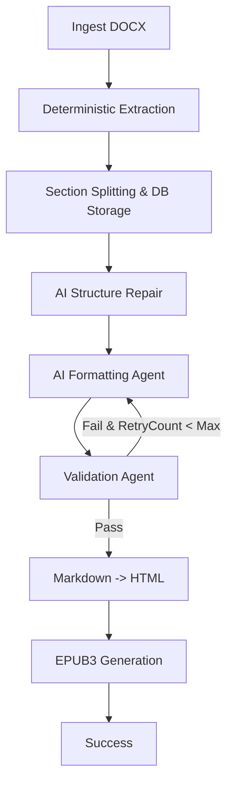

# Semantic EPUB Digital Publisher

A fully automated, portable pipeline to convert styled Word documents (`.docx`) into premium, interactive, beautifully styled EPUB3 textbooks.

---

## 📊 Pipeline Architecture & Workflow

The pipeline utilizes a hybrid deterministic-agentic architecture to ensure both layout reliability and semantic accuracy:



---

## 🚀 How to Run the Program

I have provided two self-contained batch launcher scripts to run the program without needing any terminal command experience.

### Option 1: Interactive Web Dashboard (FastAPI Localhost)
1. Double-click the **`run_web.bat`** file in the root folder.
2. The script will automatically start the FastAPI backend server and open the web dashboard in your default browser at **`http://127.0.0.1:8000`**.
3. In the web dashboard:
   - Upload any formatted Word document (`.docx`).
   - Fill in the title and author (or leave blank to extract automatically).
   - Review and dynamically edit text sections, formulas, list structures, or chapter layouts before final compilation.
   - Click Compile to download your customized EPUB textbook.

### Option 2: CLI Command Launcher
1. Double-click the **`run.bat`** file in the root folder.
2. When prompted:
   - Type or drag-and-drop your Word document (e.g., `docs/Ad_Making -Formatted.docx`) into the window.
   - Press **Enter**.
3. The pipeline will begin compiling. Your final EPUB file will be ready at **`reproduced.epub`** in the root directory!

---

## 🔑 Managing your API Key

The pipeline uses LLM APIs to run format verification and validation agents.

1. **Automatic Prompt**: On your first run, if the pipeline does not detect an API key in your environment or `.env` file, it will display a prompt in the console:
   ```
   Please enter your Gemini API Key: 
   ```
2. **Key Compatibility**: You can input your Gemini API Key. (Note: Any other OpenAI-compatible API key, such as a **Groq API Key**, is also fully supported if the model endpoint is configured in your `.env` settings).
3. **Persistent Storage**: Once entered, the key is saved automatically inside your local `.env` file (`LLM_API_KEY="..."`). You will **not** be prompted to enter it again on subsequent runs.
4. **Fallback Mode**: If you do not have an API key or wish to run without AI verification, press **Enter** on the prompt. The pipeline will run in deterministic fallback mode.
   *(Disclaimer: In deterministic fallback mode, AI-driven format verification is bypassed; formatting and layouts will reflect a standard simplified structure rather than advanced AI-optimized styles).*

---

## 📦 How to Port / Send to Someone Else

The entire project is designed to be **100% portable**. To share it:
1. Delete the `.venv/` directory and any compiled EPUBs in `reproduced.epub` to keep the file size small.
2. Zip the entire workspace folder (containing `run.bat`, `run_web.bat`, `app/`, `scripts/`, `requirements.txt`, etc.).
3. Send the zip file.
4. On their computer, they only need to:
   - Extract the zip folder.
   - Double-click **`run_web.bat`** or **`run.bat`** (which will automatically configure the Python virtual environment and dependencies on their system).
   - Enter their own API key when prompted.

---

## ✨ Key Features & Capabilities

* **Deterministic traversal parsing**: Traverses paragraphs, nested lists, and complex data tables in exact reading order.
* **Closed-loop AI agent formatting**: Utilizes specialized Structure and Formatting agents with automatic syntax/similarity validation loop and self-correction.
* **On-Demand User API Keys**: Stateless authentication where users paste their own API keys stored locally in the browser (`localStorage`), enabling secure multi-tenant hosting.
* **Local System Time Integration**: Dynamically formats database timestamps (ISO UTC) into the user's local browser timezone (e.g. IST).
* **Double numbering & counter reset resolver**: Programmatically repairs bolded/nested prefix numbers and closes lists when non-list blocks break the flow.

---

## 🛠️ Tech Stack & Requirements

* **Language**: Python 3.8+ (Cross-compatible with legacy environments using `__future__.annotations`)
* **Libraries**: python-docx, EbookLib, BeautifulSoup4, SQLAlchemy
* **Framework**: FastAPI, Uvicorn (async production web server)
* **Databases**: SQLite (easily pluggable to PostgreSQL for production)
* **Frontend**: HTML5, Vanilla CSS3 (Glassmorphic dark-theme SPA)
* **Production Gateway**: Nginx Reverse Proxy (Port 80/443 redirection)
