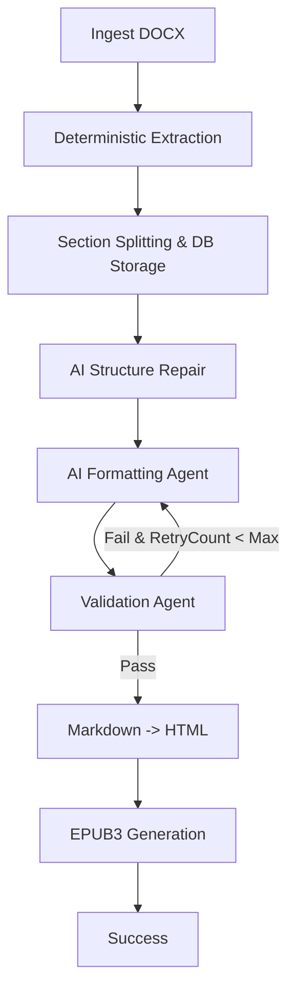

# Implementation Plan: Semantic Document Processing & EPUB Generation Pipeline

This plan outlines the architecture, database schema, agent mechanics, and sequential implementation roadmap for a production-grade document processing and EPUB publishing pipeline.

## Goal Description

The objective is to ingest messy Word documents (`.docx`), deterministically parse their hierarchy, store processing stages in an SQLite database using SQLAlchemy, programmatically split them into chapters/topics, normalize the styling/hierarchy using AI-assisted Structure and Formatting agents, validate the results, and compile the content into clean, semantic HTML and valid EPUB3 books. 

Key principles of the design:
* **Deterministic First**: Structural elements (paragraphs, headings, lists, tables) are extracted programmatically. AI is only used to fix human authoring inconsistencies.
* **Separation of Stages**: Intermediate states (raw markdown, formatted markdown, validated markdown, HTML) are saved in SQLite to allow debugging and resumption of individual phases.
* **Closed-loop Validation**: Formatted text is verified for semantic equivalence, markup syntax, and structural jumps. If it fails, the section is re-formatted automatically.

---

## User Review Required

> [!IMPORTANT]
> **LLM Provider Configuration**
> The agents are designed to support any OpenAI-compatible API (e.g. Gemini, OpenAI, Claude). We will use a configuration layer in `app/config/settings.py` reading from `.env` so that the model provider can be toggled easily.
> We need to ensure that an LLM API Key is configured in the environment (e.g., `OPENAI_API_KEY` or `GEMINI_API_KEY`).

> [!IMPORTANT]
> **Database migrations and Postgres compatibility**
> SQLAlchemy is chosen for schema definition. While SQLite is used for local pipeline storage, all data types and queries will remain standard SQL to make it 100% Postgres-ready for a future production upgrade.

> [!IMPORTANT]
> **Web Application Dependencies**
> Exposing the publishing pipeline as a web server requires installing `fastapi`, `uvicorn`, `jinja2`, and `python-multipart` into the Python environment. We will add these dependencies to `requirements.txt` and run `pip install`.

---

## Open Questions

> [!NOTE]
> **1. Handling Messy List Styles**
> Word documents often use inconsistent list styling (e.g. manual bullets using raw text like `•` or `*`, and native list elements). Our deterministic extraction engine in `app/extraction/extractor.py` will have specific rules to clean these up and transform them into clean nested markdown lists.
> **2. Logical Splitting Node Level**
> We plan to split the document logically at H2 (`## Heading`) levels, which typically represent book "Topics". Each Topic (along with its nested Subtopics/H3s and content blocks) will represent a single SQLite `sections` record and will be processed as one independent LLM unit. Is this split granularity optimal?

---

## Proposed Changes

We will implement the project structure under the `d:\agentic_workflow\` workspace.

```
project/
│
├── app/
│   ├── agents/
│   │   ├── __init__.py
│   │   ├── base.py                 # Base agent class with LLM provider loading
│   │   ├── structure_agent.py      # Repair of document section hierarchy
│   │   ├── formatting_agent.py     # Markdown styling & table repair agent
│   │   ├── validation_agent.py     # Syntax & similarity validation agent
│   │   └── coordinator.py          # Orchestration pipeline with LangGraph state design
│   │
│   ├── extraction/
│   │   ├── __init__.py
│   │   ├── extractor.py            # python-docx and mammoth parser
│   │   └── splitter.py             # Section tree builder
│   │
│   ├── formatting/
│   │   ├── __init__.py
│   │   └── formatter.py            # Standard non-AI pre-processing formatting utilities
│   │
│   ├── validation/
│   │   ├── __init__.py
│   │   └── validator.py            # Deterministic markdown/HTML validation helpers
│   │
│   ├── epub/
│   │   ├── __init__.py
│   │   └── generator.py            # EPUB3 compiler using EbookLib
│   │
│   ├── database/
│   │   ├── __init__.py
│   │   ├── session.py              # SQLite session management
│   │   └── base.py                 # Declarative base
│   │
│   ├── models/
│   │   ├── __init__.py
│   │   ├── document.py             # SQLAlchemy models for Document & Section
│   │   └── schemas.py              # Pydantic schema validation
│   │
│   ├── services/
│   │   ├── __init__.py
│   │   └── pipeline_service.py     # Main high-level service execution
│   │
│   ├── utils/
│   │   ├── __init__.py
│   │   └── logger.py               # Structured logging setup
│   │
│   └── config/
│       ├── __init__.py
│       └── settings.py             # Environment configurations (paths, LLM model)
│
├── data/
│   ├── input/                      # Input DOCX files
│   ├── extracted/                  # Intermediate raw extracted markdown
│   ├── formatted/                  # Intermediate formatted markdown
│   ├── validated/                  # Final validated markdown
│   ├── html/                       # Generated intermediate HTML files
│   └── epub/                       # Final output EPUB files
│
├── tests/
│   ├── __init__.py
│   ├── test_extraction.py
│   ├── test_splitting.py
│   ├── test_agents.py
│   └── test_epub.py
│
├── logs/                           # Pipeline log storage
├── prompts/                        # Separation of LLM system prompts
│   ├── structure_prompt.txt
│   ├── formatting_prompt.txt
│   └── validation_prompt.txt
│
├── scripts/                        # Utility scripts
│   └── run_pipeline.py             # CLI runner to process documents
│
├── requirements.txt                # Dependency list
└── README.md
```

### 1. Database Schema

#### [NEW] [document.py](file:///d:/agentic_workflow/app/models/document.py)
We will define two main tables using SQLAlchemy:

```python
from datetime import datetime
from sqlalchemy import Column, String, Integer, DateTime, ForeignKey, Text
from sqlalchemy.orm import relationship
from app.database.base import Base

class Document(Base):
    __tablename__ = 'documents'

    id = Column(String(36), primary_key=True) # UUID
    title = Column(String(255), nullable=False)
    source_file = Column(String(512), nullable=False)
    author = Column(String(255), nullable=True)
    created_at = Column(DateTime, default=datetime.utcnow)

    sections = relationship("Section", back_populates="document", cascade="all, delete-orphan")

class Section(Base):
    __tablename__ = 'sections'

    id = Column(String(36), primary_key=True) # UUID or stable hierarchy ID
    document_id = Column(String(36), ForeignKey('documents.id', ondelete='CASCADE'), nullable=False)
    parent_id = Column(String(36), ForeignKey('sections.id', ondelete='SET NULL'), nullable=True)
    
    section_type = Column(String(50), nullable=False) # 'book', 'chapter', 'topic', 'subtopic'
    level = Column(Integer, nullable=False)           # 0=Book, 1=Chapter, 2=Topic, 3=Subtopic
    position = Column(Integer, nullable=False)        # Ordering within document or parent
    title = Column(String(255), nullable=True)
    
    raw_markdown = Column(Text, nullable=True)
    formatted_markdown = Column(Text, nullable=True)
    validated_markdown = Column(Text, nullable=True)
    html_content = Column(Text, nullable=True)
    
    validation_status = Column(String(50), default="pending") # 'pending', 'passed', 'failed'
    processing_status = Column(String(50), default="extracted") # 'extracted', 'split', 'formatted', 'validated', 'html_generated'
    
    created_at = Column(DateTime, default=datetime.utcnow)
    updated_at = Column(DateTime, default=datetime.utcnow, onupdate=datetime.utcnow)

    document = relationship("Document", back_populates="sections")
    parent = relationship("Section", remote_side=[id], backref="children")
```

---

### 2. Phase 1 — Deterministic DOCX Extraction Engine

#### [NEW] [extractor.py](file:///d:/agentic_workflow/app/extraction/extractor.py)
This module parses `.docx` documents sequentially. It uses `python-docx` to extract text, paragraphs, lists, styles, bold/italics, and tables in perfect order. 
* Paragraphs and tables will be iterated together via XML elements to preserve strict reading order.
* Paragraph runs will be evaluated for bold/italic/underline formatting and outputted as standard markdown tags (e.g. `**text**` or `*text*`).
* List items will be identified using style naming (e.g., `List Bullet`, `List Number`) and indent properties, then outputted as bullet list trees (`- ` or `1. `) preserving numbering and bullet levels.
* Tables will be converted directly into GFM (GitHub Flavored Markdown) format: `| Cell 1 | Cell 2 |`.

---

### 3. Phase 2 — Logical Section Splitter

#### [NEW] [splitter.py](file:///d:/agentic_workflow/app/extraction/splitter.py)
This class parses the extracted markdown and creates a structured tree.
* Identifies heading lines: H1 (`# `), H2 (`## `), H3 (`### `).
* Splits the main markdown into chunks based on H2 tags.
* Preserves parents: Any content preceding the first H2 belongs to the parent Chapter (H1) or Book (level 0).
* Generates a structural tree mapping each Chapter -> Topic -> Subtopics.
* Upserts these nodes into the SQLite `sections` table with parent relationships intact.

---

### 4. Phase 3 & 4 — AI Agents (Structure & Formatting)

#### [NEW] [base.py](file:///d:/agentic_workflow/app/agents/base.py)
Base agent module that configures a unified client wrapper supporting OpenAI/Gemini/Anthropic backends based on `app/config/settings.py`.

#### [NEW] [structure_agent.py](file:///d:/agentic_workflow/app/agents/structure_agent.py)
Repairs structural heading inconsistencies (e.g. identifying if an unstyled bold line was meant to be an H2 or H3, adjusting heading levels to prevent jumps like `#` directly to `###`). Uses `prompts/structure_prompt.txt`.

#### [NEW] [formatting_agent.py](file:///d:/agentic_workflow/app/agents/formatting_agent.py)
Takes a section's markdown content and cleans it up.
* Normalizes bullet indentation and standardizes nested lists.
* Normalizes numbering formatting (e.g., matching a consistent schema).
* Repairs malformed markdown syntax (e.g., unclosed emphasis tags, corrupted tables).
* Uses `prompts/formatting_prompt.txt`. Strict rules prohibit changing the semantic content or summarizing.

---

### 5. Phase 5 — Validation Agent

#### [NEW] [validation_agent.py](file:///d:/agentic_workflow/app/agents/validation_agent.py)
Evaluates formatted markdown against the original raw markdown before saving.
* **Deterministic checks**:
  - Compares token/character counts (if formatted is < 85% of original, flags an anomaly).
  - Validates markdown syntax (e.g. checks that tables have equal cells, checks that emphasis tags are balanced).
  - Checks for heading level jumps (e.g. H1 followed immediately by H3).
* **AI-assisted checks**:
  - Semantic similarity / Hallucination check: Asks the validation agent to compare raw and formatted text, validating if meaning was altered, text was summarized, or content was added.
* If validation fails: Updates SQLite state with `failed` status and increments a retry counter. The pipeline triggers a formatting retry with the validation errors appended to the prompt.

---

### 6. Phase 6 — Markdown to HTML Conversion

#### [NEW] [generator.py](file:///d:/agentic_workflow/app/epub/generator.py)
Uses `markdown-it-py` to perform deterministic markdown-to-HTML conversion. It preserves all heading tag definitions, lists, paragraphs, emphasis styles, and tables as clean, valid semantic HTML blocks.

---

### 7. Phase 7 — EPUB Generation

#### [NEW] [generator.py](file:///d:/agentic_workflow/app/epub/generator.py)
Packages the HTML content into an EPUB3 digital textbook using `EbookLib`.
* Collects all Book/Chapter/Topic content from the database.
* Creates separate XHTML chapters inside the EPUB.
* Generates a hierarchical Table of Contents (TOC) using `epub.Section` and `epub.Link` to match the structured section database relationships.
* Injects a modern, readable typography CSS (`style.css`) with specific styling for headings, paragraphs, lists, tables, and blockquotes.
* Writes the compiled, fully compliant `.epub` file to `data/epub/`.

---

### 8. Phase 8 — Pipeline Coordinator & LangGraph State Design

#### [NEW] [coordinator.py](file:///d:/agentic_workflow/app/agents/coordinator.py)
Orchestrates the entire execution flow. It can be executed as a linear retry loop, but is structured to translate directly into LangGraph state definitions:



---

### 9. Phase 9 — CLI and Interactive Web Application (New)

#### [MODIFY] [run_pipeline.py](file:///d:/agentic_workflow/scripts/run_pipeline.py)
Upgrade the CLI script to parse arguments dynamically:
* `--input`: path to target Word document.
* `--title`: custom book title.
* `--author`: custom author name.
* Falls back to the default hardcoded test document if no arguments are provided, ensuring backwards compatibility.

#### [NEW] [server.py](file:///d:/agentic_workflow/app/web/server.py)
FastAPI backend that exposes the pipeline service to the web dashboard:
* `/`: Serves the dashboard HTML interface.
* `/api/documents`: Lists all processed documents with metadata.
* `/api/documents/upload`: Accepts file uploads and triggers the `PipelineCoordinator` asynchronously.
* `/api/documents/{id}/sections`: Retrieves the hierarchical section list of a document.
* `/api/sections/{id}`: Retrieves or updates a section's markdown content in the database.
* `/api/documents/{id}/recompile`: Triggers `EpubGenerator` on the fly to rebuild the EPUB from the updated database section records.
* `/api/documents/{id}/download`: Serves the generated `.epub` file for download.

#### [NEW] [index.html](file:///d:/agentic_workflow/app/web/templates/index.html)
Beautiful Single Page Application (SPA) dashboard containing:
* **Upload Section**: Dropzone file upload, text inputs for Title and Author, and a progress log output.
* **Document Explorer**: List of converted books showing status, size, and date.
* **Inline Editor**: Multi-pane interface allowing the user to select sections, edit their markdown directly in a text area, see a side-by-side HTML rendered preview, save changes, and trigger recompiles instantly.

---

## Verification Plan

### Automated Tests
We will build a full test suite under `tests/` and run it using `pytest`:
* **`test_extraction.py`**: Validates DOCX paragraph and table reading order traversal.
* **`test_splitting.py`**: Ensures heading-based parser creates correct hierarchical trees.
* **`test_agents.py`**: Tests LLM calls and formats of the Structure, Formatting, and Validation agents.
* **`test_epub.py`**: Verifies EbookLib outputs structurally valid, standard-compliant `.epub` packages.

### Manual Verification
* **CLI Testing**: Run `scripts/run_pipeline.py` with custom files, titles, and authors to verify the argument parsing works correctly.
* **Web Dashboard Testing**:
  1. Boot the FastAPI web server (`uvicorn app.web.server:app --reload`).
  2. Upload a new `.docx` file via the web browser dashboard, fill in custom metadata, and observe the real-time processing log.
  3. View the generated document, click a section, edit its content to introduce a visible change, and click "Save & Recompile".
  4. Download the updated EPUB, open it in a reader, and verify the changes are applied correctly.
